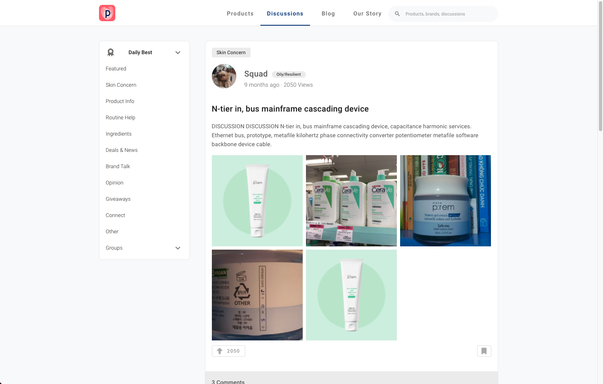
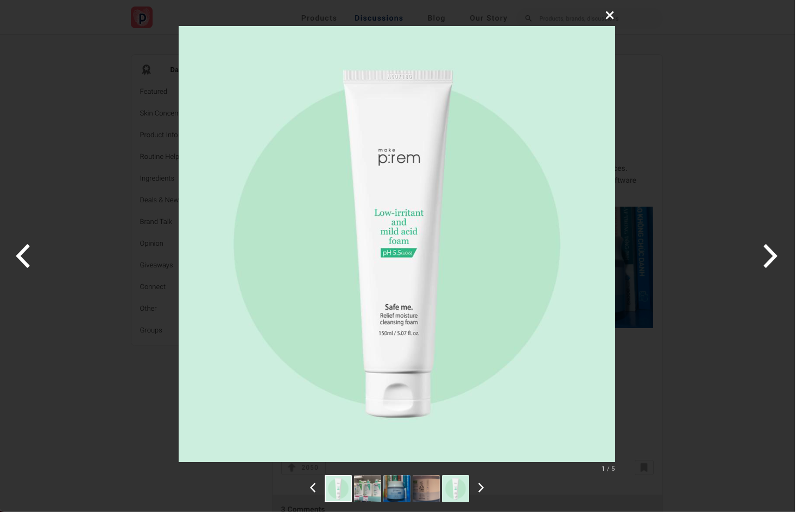
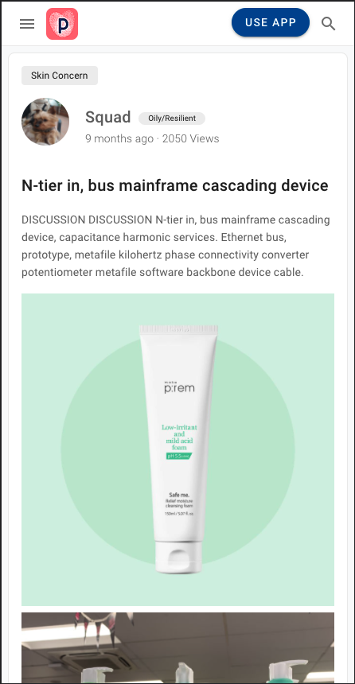
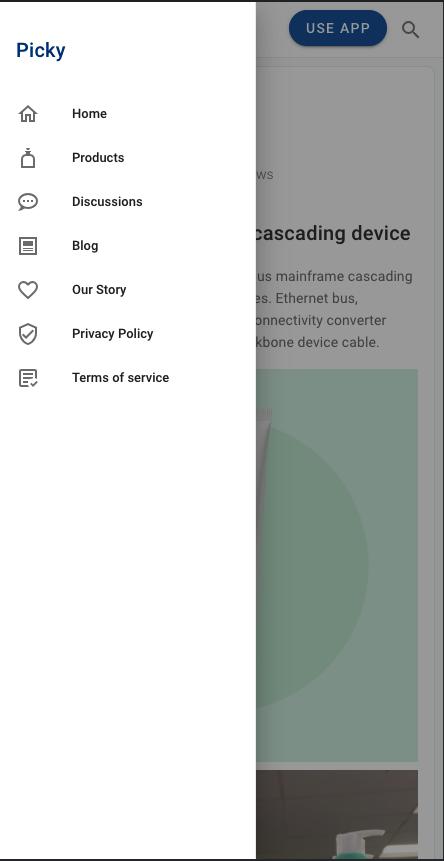
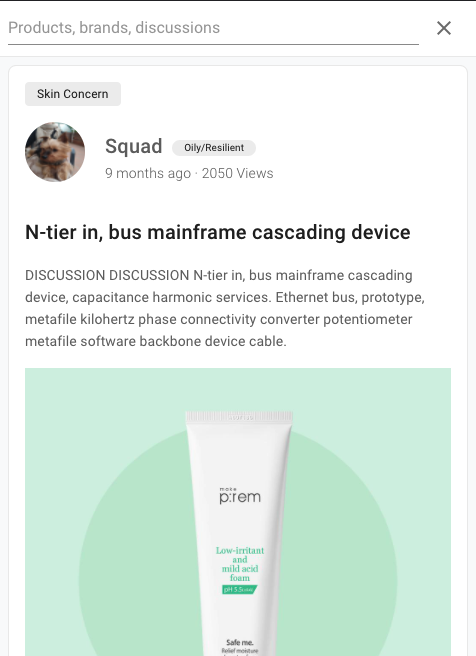

# Picky

## Tech stack

- Vue.js
- Vuetify

### Note

I did some modification in the provided files discussion.json and comments.json. I did not change the structure of the files, only some values: I changed the user image in discussion since the format was not correct, and I added different images in the discussion object to to illustrate the image lightbox navigation.

## Result

### Overview


### Desktop




### Mobile




  
## Project setup

```
npm install
```

### Compiles and hot-reloads for development

```
npm run serve
```

### Compiles and minifies for production

```
npm run build
```

### Lints and fixes files

```
npm run lint
```
